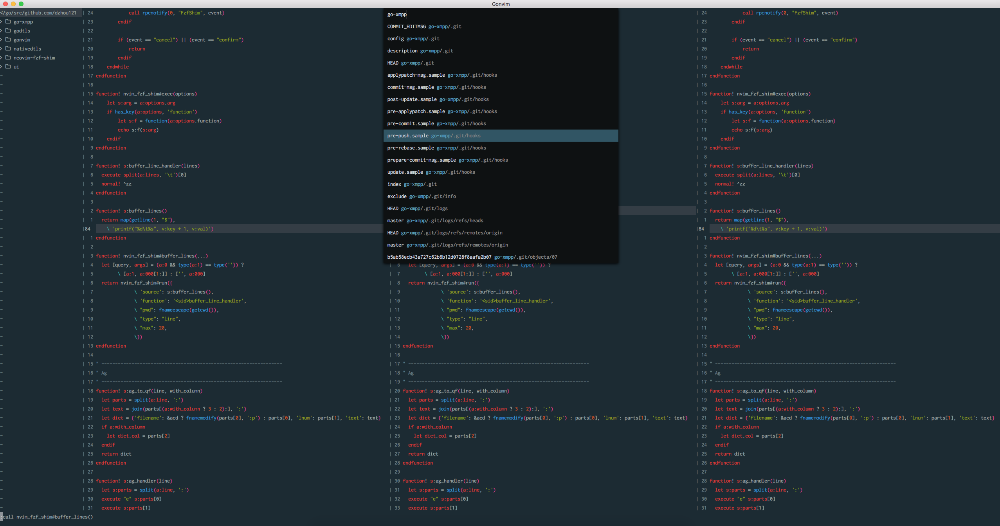
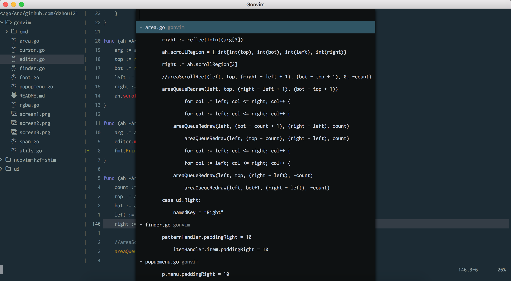

Neovim GUI written in Golang, using a forked ui libray from https://github.com/andlabs/ui

# Requirements
- Neovim

# Install
Only working in macOS right now
```
go get -u github.com/dzhou121/gonvim/cmd/gonvim
```

After succesfully installing to GOBIN, you can run it
```
gonvim
```

# Features

A fuzzy finder in the GUI



